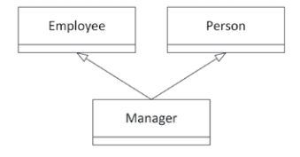

# Chapter-5 面向对象设计

## 5-1

假设你想写一个赛车游戏。你需要对某种汽车建模，在本练习假设中只有一种类型的汽车。该车的每个实例都需要多个属性，例如发动机的当前功率输出、当前燃油使用量、轮胎压力、驾驶灯是否打开、挡风玻璃雨刮器是否启动等。游戏应该允许玩家配置不同的引擎、不同的轮胎、定制的驾驶灯和挡风玻璃雨刷等。你会如何对这样一辆车进行建模，为什么？

车并不是一个引擎，所以应该采用从属包含关系，即：

```txt
|-车
|--引擎
|---输出
|---燃油使用
|--轮胎
|-等等
```

## 5-2

继续练习 5-1 中的赛车游戏，你当然希望能够支持人工驾驶汽车，但也希望包含对人工智能(AI)驱动汽车的支持。你将如何在游戏中对此进行建模？

将输入与车辆部件剥离开，人工驾驶和 AI 驾驶由输入方式决定（AI可能使用与人工不同的输出-输入反馈方式）。

## 5-3

假设一个人力资源(HR)应用程序的一部分具有以下 3 个类。

- Employee：关注雇员 ID、薪水、入职日期等
- Person：关注姓名和地址
- Manager：关注团队中有哪些雇员



你认为上图中的内图中怎么样？你能对它进行一些改动吗？该图没有显示不同类的任何属性或行为，因为这是练习 5-4 的主题。

不太好，应该把Person改为Employee下级，避免姓名、地址一致而ID不同。

## 5-4

从练习 5-3 的最终类图开始，在类图中添加一些行为和属性。最后，对经理管理员工团队这一事实进行建模。

略。
